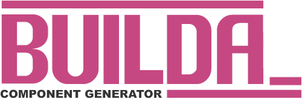

# 

## Monorepo readme

This is the readme for the monorepo. To view the readme for each individual workspace, see below:

- [Builda](./builda/README.md)
- [Scaffolds](./scaffolds/README.md)
- [Prefabs](./prefabs/README.md)
- [Website](./website/README.md)

## Support me

### Donate

I made this with love and of course it is free for you to use and modify however
you see fit, however if you would like to buy me a coffee to say thanks, I
certainly won't complain :)

### Patreon

I have a [Patreon](https://www.patreon.com/stelmosfire) where you can support me
and help me keep this project alive. At the moment I only have a single 'Offer
Support' tier but I'm sure I'll be adding more tiers in the future when I get
around to fleshing out my page.

[next.js](https://nextjs.org/)
[storybook](https://storybook.js.org/)
