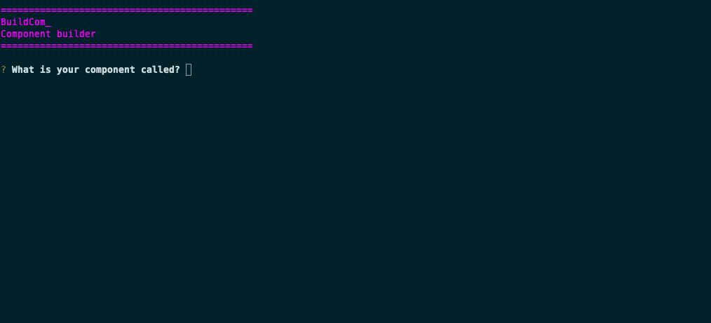

# 

[](https://www.npmjs.com/package/builda)
[](https://www.npmjs.com/package/builda)
[](https://github.com/st-elmos-fire/builda)
[](https://github.com/st-elmos-fire/builda)


[](https://patreon.com/buildcom?style=for-the-badge)

## Setup

You can either install `builda` as a global module or install it locally into your
project, if you are using the `.builda.yml` file, installing locally is recommended.


```bash
npm i -g builda
```


```bash
yarn global add builda
```


```bash
npm i --dev builda
```


```bash
yarn add -d builda
```

Then you can initialise builda by typing `builda --init` this will create a `.builda.yml`
file in your project root. (see [Configuration](#configuration) below)

## Usage

Once you have installed builda, you can use it to build your project files.

## Screenshot



The component produced in this animation is available to view here: https://github.com/foxleigh81/builda/tree/master/examples/my-example-component

## Configuration

You can specify some defaults by creating a `.builda.yml` file in your home directory.

You can create this file manually or by running `builda --init`

> 🚨 **WARNING** : If you're coming from the `buildcom` project, you might want
> to migrate instead of initialising. See [Migrating](#migrating-from-buildcom) below.

### It should look like this

```yaml
# The folder the components will be generated in. This is relative to the current working directory.
output: './components'
# Use TypeScript instead of JavaScript? Set to false or omit to disable.
typescript:
  # Where should the Prop Types be generated? Inline or separate file?
  inline: true
# Generate storybook stories for each component. Set to false or omit to disable.
storybook:
  # Use CSF or MDX to generate storybook stories
  use_mdx: true
  # Add parameters to the generated stories (one per line)
  # (see https://storybook.js.org/docs/react/writing-stories/parameters#story-parameters for more info).
  params:
    # This is an example which will add a 'status' parameter to the story.
    - "status: { type: 'alpha' }"
# Generate tests for each component. (Only Jest is supported at the moment.)
# Set to false or omit to disable.
tests:
  # Filename format for test files can be either 'spec' or 'test', outputs as
  # index.[choice].[ext], where [ext] is based on your answer to 'use_typescript'.
  extension: 'test'
# Generate a stylesheet for each component. Set to false or omit to disable.
styles:
  # Specify the CSS preprocessor to use, e.g. 'sass', 'less', 'stylus', 'scss', or 'none'.
  preprocessor: 'scss'
  # Use CSS modules?
  modules: true
# Generate a README.md file for each component (recommended unless using MDX for storybook stories).
generate_readme: false
# Generate additional directories for each component (e.g. 'images', 'helpers', 'mocks') (one per line).
# This isn't recommended unless you have a specific reason to do so, directories should be created
# on a per-component basis as needed.
directories: []
# If true, example code will be added to the component files. If false, the files will be empty.
prepopulate: true
```

If you are using the `.builda.yml` file you can run the `builda` command by itself
and it will only ask one what to name your component. You can also specify the name
of the component in the command line:

```bash
builda my-component
```

This will generate a component called `my-component` in the directory specified
in the `.builda.yml` file.

You can also use this method to create multiple components at once:

```bash
    builda my-component my-other-component
```

## Options

You can also supply builda with the following arguments:

| Argument              | Description                                                                       | default           |
| --------------------- | --------------------------------------------------------------------------------- | ----------------- |
| `--output` , `-o`     | where to generate your new component (relative to your current working directory) | current directory |
| `--dirs`, `-d`        | Add extra directories as comma separated values                                   | empty             |
| `--storybook`, `-s`   | Generate storybook file                                                           | false             |
| `--mdx`, `-mdx`       | Override the default CSF format and us MDX format for Storybook stories           | false             |
| `--test`, `-t`        | Generate test file (only jest supported at the moment)                            | false             |
| `--css`, `-c`         | Generate stylesheet file (see 'CSS Generation' for details)                       | 'css'             |
| `--modules`, `-m`     | Usee CSS Modules (see 'CSS generation' for details)                               | false             |
| `--typescript`, `-T`  | Generate files with TypeScript extensions                                         | false             |
| `--readme`, `-r`      | Generate files with TypeScript extensions                                         | false             |
| `--prepopulate`, `-p` | Don't add example code, just create empty files                                   | false             |
| `--force`, `-f`       | Ignore existing folders and delete/recreate component files anyway                | false             |
| `--help`, `-h`        | Displays the help text                                                            |
| `--version`           | Displays version number                                                           |

## CSS Generation

The following options exist for CSS usage:

- CSS
- SCSS
- SASS

In the config file, you only need to specify if you are using sass/scss, you do
this by adding `preprocessor: "scss"` or `preprocessor: "sass"` to the config file
in the `styles` section. If you are not using a preprocessor, then you can omit
this property or set it to `false`.

If you are only using arguments then you can choose from the following options:

| Stylesheet type | option         |
| --------------- | -------------- |
| CSS             | `--css "css"`  |
| SCSS            | `--css "scss"` |
| SASS            | `--css "sass"` |

Each file is also available as a [css module](https://github.com/css-modules/css-modules)
by adding an additional `--modules` or `-m` argument.

e.g.

The following will output a CSS Module file (`styles.modules.css`)

```bash
builda "My Component" --css "css" -m
```

## Project Assumptions

builda makes the following assumptions about your dependencies:

- That you are using [React](https://reactjs.org/)
- If you generate a CSS file for a particular pre-processor, that you already have
  that pre-processor configured for use in your project
- If you generate a test file, that you already have Jest or testing-library
  installed and configured for use in your project
- If you generate a storybook file, that you have [Storybook](https://storybook.js.org/)
  installed and configured to use the appropriate plugins for the type of stories you are generating.
- If you opt to use any variation of [CSS modules](https://github.com/css-modules/css-modules)
  that your project is already configured to make use of them.
- If you generate TypeScript files, that your project is already configured to
  use them

## Storybook

This project can output Storybook files for each component, for those of you who
don't know what storybook is, here is a brief introduction:

[](https://www.youtube.com/watch?v=p-LFh5Y89eM)

You can output storybook files in the
[CSF](https://storybook.js.org/docs/formats/component-story-format/) format or
the [MDX](https://github.com/storybookjs/storybook/blob/next/addons/docs/docs/mdx.md)
format instead, you can do this by specifying it in the config file or adding
the `--mdx` flag to the command (CSF format is default).

## Example

You can see an example output of this builda here: https://github.com/foxleigh81/builda/tree/master/examples/example

That component can be generated by running one of the following commands:

### If you are using the .builda.yml file

```bash
builda example
```

### If you are using the argument mode

```bash
builda Example --storybook --mdx --css="scss" --modules --typescript --prepopulate --test
```

or the shorthand version of the above:

```bash
builda Example -c "scss" -mTpts -mdx
```

## Migrating from Buildcom

If you previously used the [buildcom](https://npmjs.com/package/buildcom) package,
from at least version 2.0.0 you can migrate to builda by running the following command:

<!-- TODO: Add migrate function -->

```bash
builda --migrate
```

This will convert your existing .buildcomrc file to a .builda.yml file. You can
then run the `builda` command as normal. If you don't already have a .buildcomrc
file, you do not need to migrate, you can just run `builda --init`

### Migrating from **`buildcom` v1.x.x** or below

If you are migrating from version 1.x.x or below then you'll need to migrate manually,
the best way to do this is to run `builda --init` and then manually copy the
settings from your old .buildcomrc file to the new .builda.yml file.

### Major changes in **`buildcom` v2.0.0** and above

- File output formats have now changed, most of this is only cosmetic, however
  storybook files can now include parameters.
- The `--prepopulate` flag has replaced the `--blank` flag, which means blank
  files are now the default. If you want to keep the old behaviour, add `--prepopulate`
  or `-p` to the command line or add `prepopulate: true` to the config file.
- Support for Stylus has now been deprecated and will be removed in a future version.
  Scaffold files will no longer receive updates.
- Support for LESS has now been deprecated and will be removed in a future version.
  Scaffold files will no longer receive updates.

### Major changes between **`buildcom` v3.x.x** and **`builda` v4.x.x**

- Components can no longer be generated via the questionnaire, the questionnaire
  now only exists to generate the config file via the `--init` flag.
- Stylus and LESS support has been removed. Do not upgrade to `builda` if you
  are using these pre-processors. `buildcom` will no longer receive updates but
  it will continue to work as normal.
- If you are using storybook, `builda` will no longer automatically prefix the
  storybook files with the `atom/` namespace, you can now specify any namespace
  you want by simply prefixing the component name, e.g. `atom/my-component`. If
  you wish to preserve the old behaviour or if you have a namespace you wish
  to use for every component, you can add it to the config file in the `storybook`
  section, e.g. `namespace: "atom"`.

### Roadmap

This project has gained some traction in the recent months and as this was just
a project I built for the use of myself and my team many years ago, I have not
had much time to work on it - so I find the codebase a bit embarrassing now. I h
ave been working on it for the past few months and have a few ideas for future features.

I personally use buildcom to generate components for my projects and over the years
I've developed a very robust and reusable file structure, based on [next.js] and
[storybook], so I plan to create a few tools to make generating items for that
boilerplate easier as well
as a tool to generate the entire boilerplate itself. These will likely be
namespaced packages under the `@builda` scope which I have recently bagsied. I
have no idea about timescales for these but I'm hoping to do at least a few alpha
releases of each package in the next couple of months.

## Support me

### Donate

I made this with love and of course it is free for you to use and modify however
you see fit, however if you would like to buy me a coffee to say thanks, I
certainly won't complain :)

[](https://ko-fi.com/I3I21FRCN)

### Patreon

I have a [Patreon](https://www.patreon.com/stelmosfire) where you can support me
and help me keep this project alive. At the moment I only have a single 'Offer
Support' tier but I'm sure I'll be adding more tiers in the future when I get
around to fleshing out my page.

[next.js](https://nextjs.org/)
[storybook](https://storybook.js.org/)
